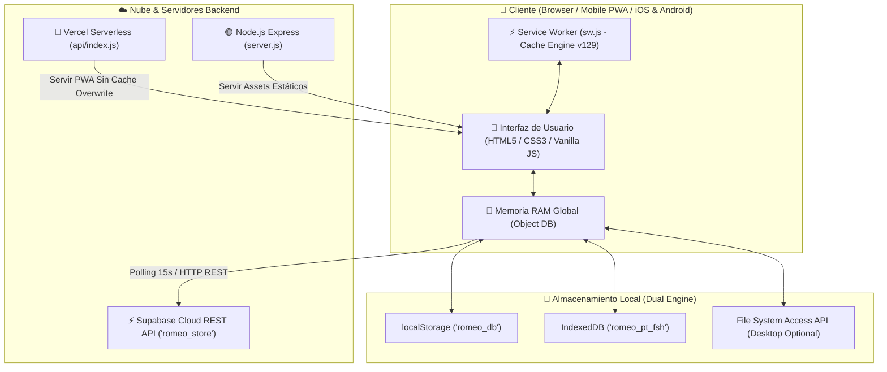
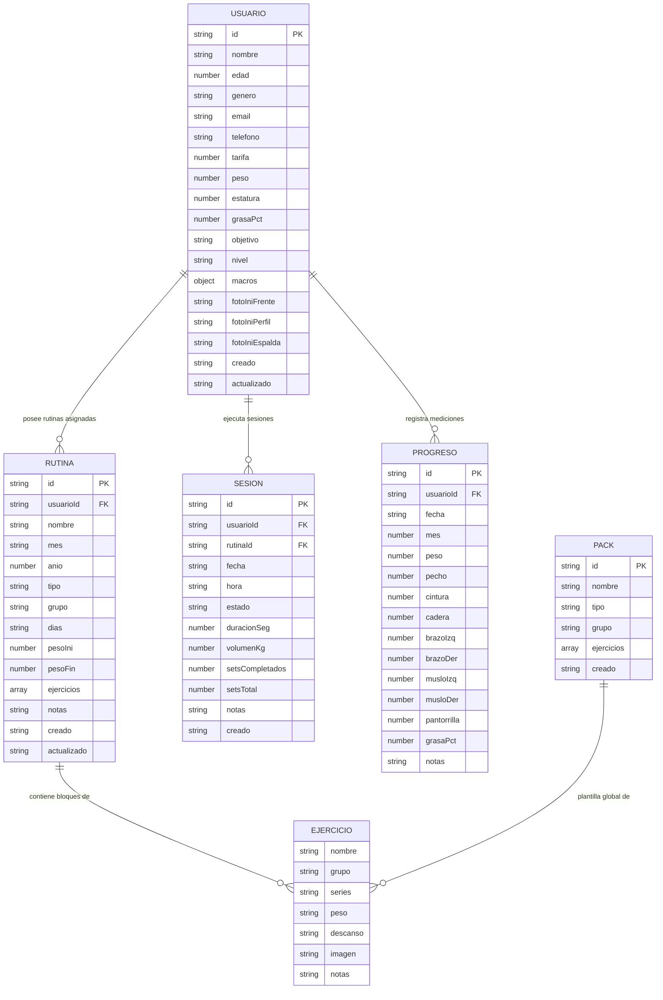
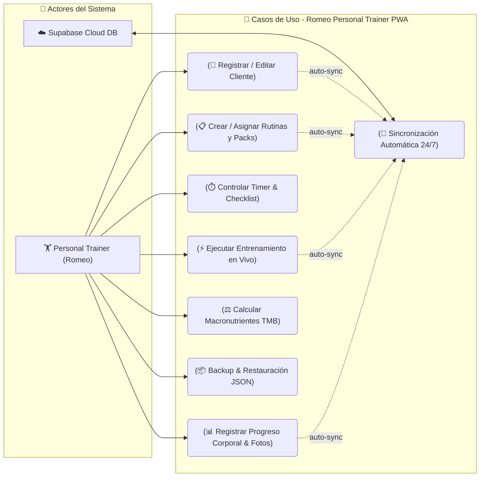
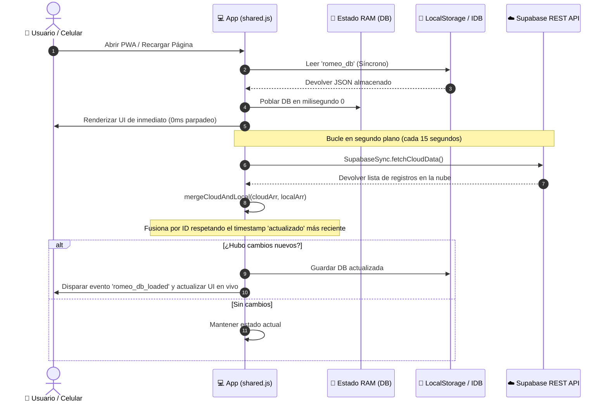
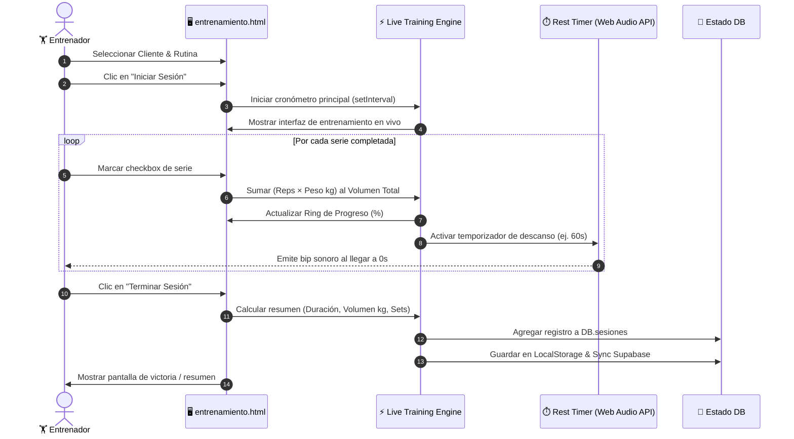
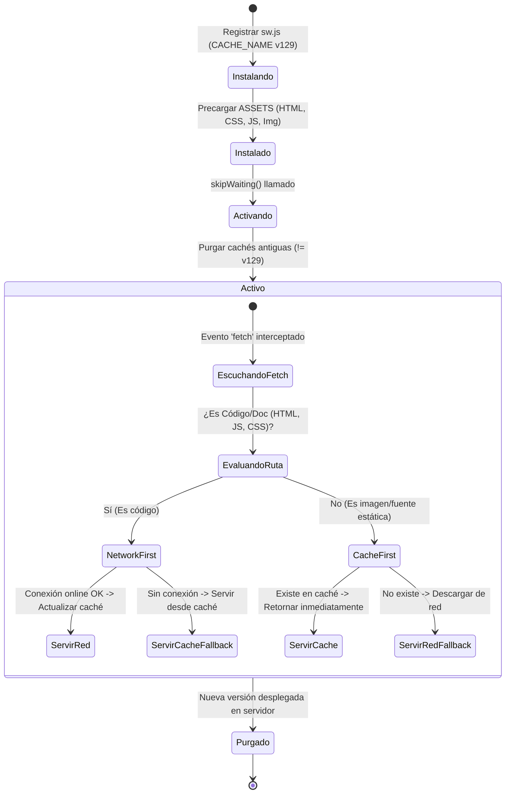
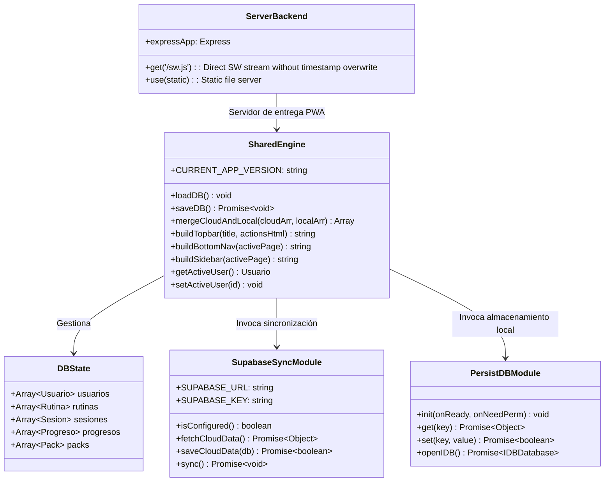
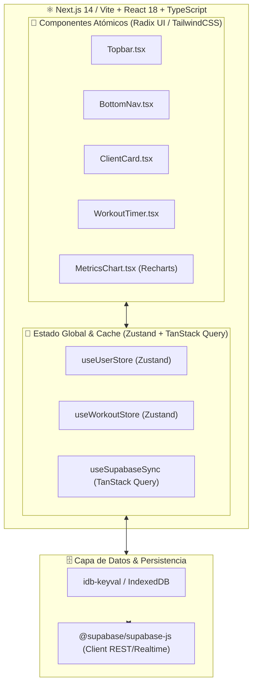

# 📐 Documentación de Arquitectura y Plan de Migración — Romeo PT

> **Documento Técnico de Referencia y Diagramación UML**  
> *Preparado para la migración de la versión actual (Vanilla JS / PWA / Supabase REST) hacia la arquitectura definitiva (React / Next.js / TypeScript / TailwindCSS / Zustand).*

---

## 📋 Contenido

1. [Visión General del Sistema](#-visión-general-del-sistema)
2. [Diagramas UML del Sistema (8 Diagramas Mermaid)](#-diagramas-uml-del-sistema)
   - [1. Diagrama de Arquitectura General del Sistema (Componentes PWA & Servidor)](#1-diagrama-de-arquitectura-general-del-sistema)
   - [2. Diagrama de Entidad-Relación (ERD - Modelo de Datos)](#2-diagrama-de-entidad-relación-erd---modelo-de-datos)
   - [3. Diagrama de Casos de Uso (Funcionalidades del Entrenador)](#3-diagrama-de-casos-de-uso)
   - [4. Diagrama de Secuencia: Sincronización Híbrida 24/7 (Local-Cloud Sync)](#4-diagrama-de-secuencia-sincronización-híbrida-247)
   - [5. Diagrama de Secuencia: Flujo de Entrenamiento en Vivo](#5-diagrama-de-secuencia-flujo-de-entrenamiento-en-vivo)
   - [6. Diagrama de Estados: Ciclo de Vida del Service Worker PWA](#6-diagrama-de-estados-ciclo-de-vida-del-service-worker-pwa)
   - [7. Diagrama de Clases y Módulos de Estado (JavaScript Core)](#7-diagrama-de-clases-y-módulos-de-estado)
   - [8. Diagrama de Arquitectura Objetivo (Target Architecture: React/Next.js/TypeScript)](#8-diagrama-de-arquitectura-objetivo)
3. [Plan Estratégico de Migración por Fases](#-plan-estratégico-de-migración-por-fases)
4. [Estrategia de Mantención de la Base de Datos y Supabase](#-estrategia-de-mantención-de-la-base-de-datos-y-supabase)

---

## 📖 Visión General del Sistema

**Romeo Personal Trainer** es una plataforma web PWA/SPA diseñada para optimizar la gestión de clientes, planificación de rutinas mensuales, ejecución de entrenamientos en tiempo real y seguimiento antropométrico corporal.

### Pilares Fundamentales de la Arquitectura Actual
- **Carga Síncrona Instantánea (0ms)**: La aplicación recupera el estado de los clientes y rutinas desde `localStorage` / `IndexedDB` en el milisegundo cero del arranque, eliminando parpadeos o pantallas en blanco en dispositivos móviles.
- **Sincronización Transparente 24/7**: Un proceso en segundo plano consulta la API REST de Supabase cada 15 segundos ejecutando una fusión inteligente (`mergeCloudAndLocal`) para compartir información en tiempo real entre múltiples celulares y computadoras.
- **Compatibilidad Multiplataforma**: Habilitada para iOS Safari (WebKit) y Android Chrome con manejo seguro de Service Worker (`Network-First` para código y `Cache-First` para multimedia).

---

## 📊 Diagramas UML del Sistema

### 1. Diagrama de Arquitectura General del Sistema

Este diagrama ilustra la separación de capas entre la interfaz del usuario en dispositivos móviles/escritorio, los motores de persistencia local y los servicios en la nube.



---

### 2. Diagrama de Entidad-Relación (ERD - Modelo de Datos)

Representación de los modelos centrales de datos que constituyen el estado unificado `DB`.



---

### 3. Diagrama de Casos de Uso

Muestra las interacciones principales que el Personal Trainer (Romeo) realiza dentro de la aplicación.



---

### 4. Diagrama de Secuencia: Sincronización Híbrida 24/7

Detalla la carga instantánea en 0ms desde la memoria local y la sincronización continua en segundo plano con Supabase.



---

### 5. Diagrama de Secuencia: Flujo de Entrenamiento en Vivo

Describe la ejecución de una sesión de entrenamiento con temporizador y cálculo de volumen en tiempo real.



---

### 6. Diagrama de Estados: Ciclo de Vida del Service Worker PWA

Muestra cómo el Service Worker gestiona el almacenamiento en caché y la auto-actualización forzada.



---

### 7. Diagrama de Clases y Módulos de Estado

Estructura de las funciones y objetos globales que componen la lógica de `shared.js`, `persist.js` y `api/index.js`.



---

### 8. Diagrama de Arquitectura Objetivo (Target Architecture: React/Next.js/TypeScript)

Este diagrama define la arquitectura moderna objetivo para la migración definitiva del proyecto.



---

## 🚀 Plan Estratégico de Migración por Fases

Para migrar esta aplicación de **Vanilla JS** a **Next.js / Vite + React + TypeScript** sin interrumpir la operación del entrenador ni perder datos de clientes, se seguirá el siguiente roadmap de 4 fases:

```
┌─────────────────┐     ┌─────────────────┐     ┌─────────────────┐     ┌─────────────────┐
│     FASE 1      │ ──> │     FASE 2      │ ──> │     FASE 3      │ ──> │     FASE 4      │
│ Creación Rama   │     │ Componentes     │     │ Migración       │     │ Despliegue      │
│ & Configuración │     │ UI & Zustand    │     │ Sincronización  │     │ Definitivo      │
└─────────────────┘     └─────────────────┘     └─────────────────┘     └─────────────────┘
```

### Fase 1: Creación de la Rama Git y Entorno de Desarrollo
1. Crear una nueva rama independiente: `git checkout -b feature/migration-react-vite`.
2. Inicializar proyecto con Vite + React + TypeScript + TailwindCSS.
3. Migrar las variables de entorno (`NEXT_PUBLIC_SUPABASE_URL`, `NEXT_PUBLIC_SUPABASE_KEY`).

### Fase 2: Componentización y Gestión de Estado
1. Definir los tipos de TypeScript (`types/index.ts`) basados en las entidades de la documentación (`Usuario`, `Rutina`, `Sesion`, `Progreso`, `Pack`).
2. Crear la tienda Zustand (`stores/useGymStore.ts`) replicando la carga síncrona instantánea desde `localStorage`.
3. Construir los componentes UI reutilizables (TopBar, BottomNav, ClientCards, Timer).

### Fase 3: Migración de Módulos Complejos
1. **Entrenamiento en Vivo**: Reconstruir el cronómetro y el contador de volumen en un custom hook (`useLiveWorkout`).
2. **Progreso Antropométrico**: Reemplazar las gráficas SVG manuales por **Recharts** o **Tremor**.
3. **Nutrición y Calculadora de Macros**: Reconstruir la calculadora TMB interactiva con sliders en React Hook Form + Zod.

### Fase 4: Pruebas de Compatibilidad y Despliegue
1. Validar la importación/exportación de backups JSON antiguos para garantizar retrocompatibilidad del 100%.
2. Probar la PWA instalable en iOS Safari y Android Chrome.
3. Fusionar la rama `feature/migration-react-vite` hacia `main` y publicar la versión definitiva en Vercel.

---

## 🔒 Estrategia de Mantención de la Base de Datos y Supabase

- **Estructura de la Tabla Cloud**: La tabla `romeo_store` mantendrá su formato JSONB unificado durante la migración para no romper ninguna versión activa en celulares de clientes.
- **Validación de Schema**: El nuevo código en TypeScript incorporará esquemas de validación con **Zod** para prevenir la inyección de datos corruptos o malformados.
